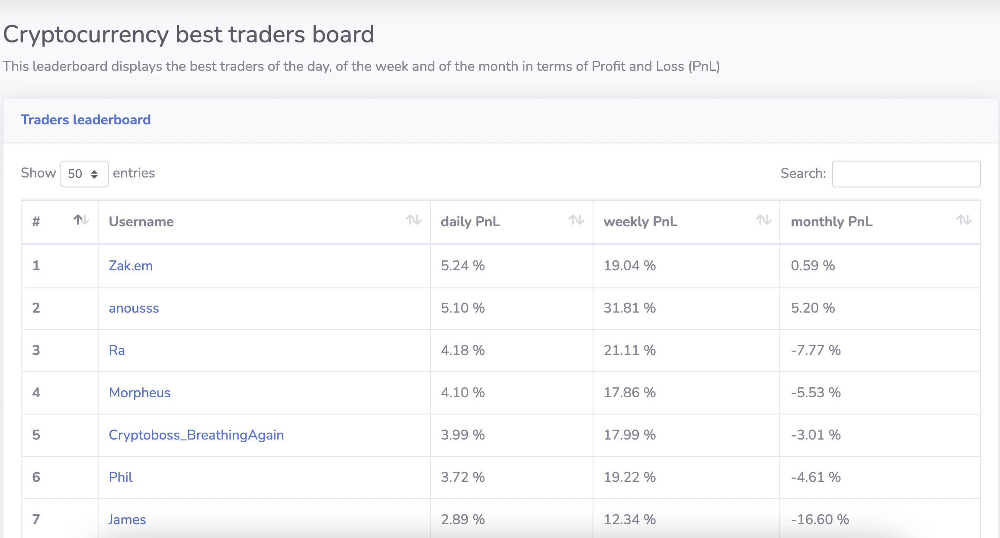
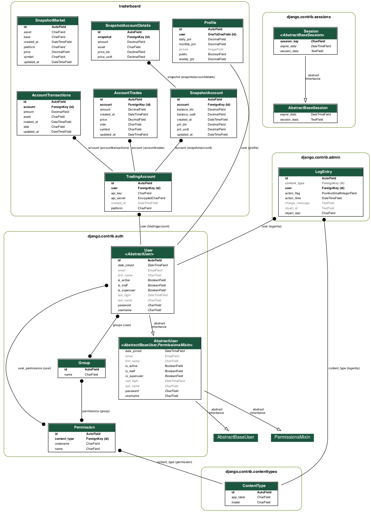

# Coimarketleague

## About
[Coinmarketleague](https://coinmarketleague.net/) is a plaform where crypto-traders can visualize their portfolio but also the one of their friends.

### Trader board
The main page of the website is the trader board which ranks every trader according to their 24h PnL, 7d PnL and 30d PnL. The ranking is refreshed every hour.

### Trader profile

#### Rules
- All the calculation are made in __USDT__
- All the graphs are displayed with a daily granularity and the time window can be modified using the calendar filter (default is last 7 days + today)
- Metrics are private if they are tagged with a :lock: , which means that these are not visible by your peers

#### Metrics
Each trader has a profile which displays a bunch of statistics on a dashboard:
- __PnL (Daily)__: Profit and Loss compared to 24h ago (updated every hour) 
- __PnL (Weekly)__: Profit and Loss compared to 7d ago (updated every hour)
- __PnL (Monthly)__: Profit and Loss compared to 30d ago (updated every hour) 
- :lock: __Total Balance__: Value of your portfolio (real time) 
- __Asset allocation__: What are the crypto you currently possess
- __Balance performance__: For each coin you possess, what is the 24h performance and the performance since the last time you bought it
- __Cumulative PnL__: Using the calendar filter, plot your PnL evolution since the first day. A comparison with the BTC price evolution is available
- :lock: __Daily PnL__: How much USDT did you earn each day in the calendar time window
- :lock: __Balance Net Worth__: What is the value of the portfolio of each day in the calendar time window
- __Trade history__: Display all the trades made during the calendar time window
- :lock: __Transaction history__: Display all the transactions made during the calendar time window

## Goals and vision of the website

### Monitoring
The primary goal of Coinmarketleague is to allow traders to compare their performance in real time. The website should be platform agnostic and accept traders from many plaform exchanges. However it is necessary to have a POC of the website, this is why we will only focus on developing features for Binance traders (because highest crypto trading volume).

### Trading signals
The natural follow up for Coinmarketleague is to propose a notification system when a trader you follow makes a move. Since the website has no App, the first step will be to use traditionnal notification applications (Telegram, Signal, Whatsapp). 

### Copy trading
An eventual evolution to the previous point is to automate the copy trading of a trader you decided to follow. This option will of course involve a payment system.

## Website architecture
The website backend is designed in Python (Django).

### Database architecture
The database is a PostgreSQL hosted on Heroku

### Processes

#### Web
Process responsible of running the WSGi web server

#### Event
A process that is responsible to capture every trade and transactions of the registered trading accounts. This uses [unicorn-binance-websocket-api](https://github.com/oliver-zehentleitner/unicorn-binance-websocket-api) that ensures a websocket connection is maintained for each trading account.

#### Worker
A Celery worker responsible of:
- dealing with the heavy calculations that can be run asynchronously. This removes load from the other processes.
- taking an hourly snapshot of each trading account 

#### Redis
Message queue that delivers jobs to the Celery worker

### Host
Coimarketleague is hosted on Heroku. Each process mentionned above is running on a Heroku dyno